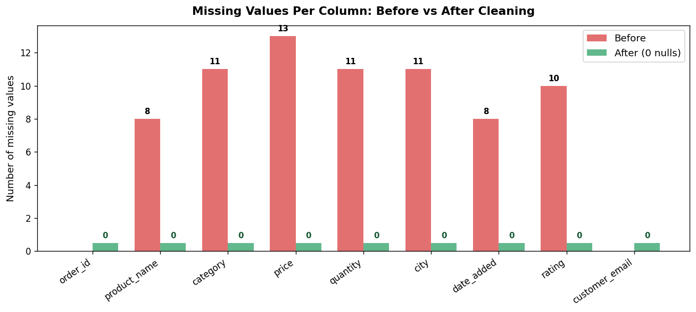
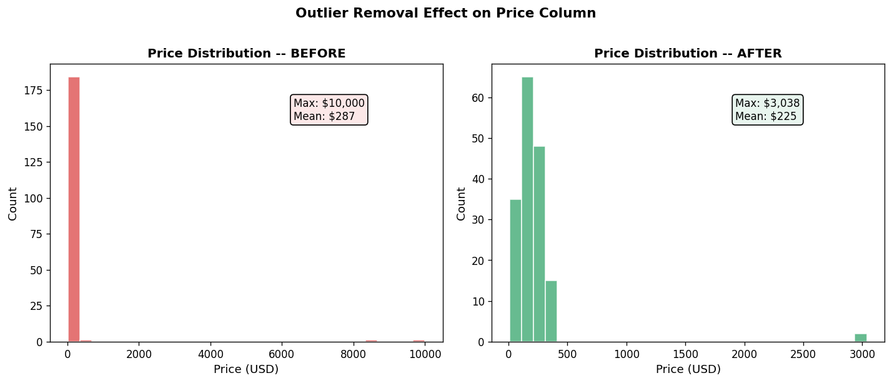

# E-Commerce Data Cleaning

A portfolio project demonstrating professional-grade data cleaning on a messy e-commerce dataset using Python, Pandas, and NumPy.

---

## Project Description

Raw data from e-commerce systems is rarely clean. This project simulates a realistic dirty dataset (200+ rows of product orders) and applies a systematic, documented cleaning pipeline that fixes every common data-quality problem.

The full cleaning process is exposed in an interactive Jupyter Notebook so that clients and collaborators can follow every decision.

---

## Screenshots

*(Add your notebook screenshots here after running the project)*

| Before Cleaning | After Cleaning |
|---|---|
|  |  |

**Charts generated by the notebook:**

| Missing Values | Price Distribution |
|---|---|
|  |  |

---

## Data Problems Solved

| Problem | Example | Fix Applied |
|---|---|---|
| Duplicate rows | 20 exact copies | `drop_duplicates()` |
| Missing values | NaN in price, city, rating | Median / mode imputation; drop if critical |
| Inconsistent categories | `"electronics"`, `"ELECTRONICS"` | Title Case normalisation |
| Inconsistent cities | `"NY"`, `"new york"`, `"NEW YORK"` | Lookup map → canonical name |
| Price as string | `"$19.99"`, `"19,99 USD"` | Strip symbols, fix decimals, cast to float |
| Mixed date formats | `"01/15/2024"`, `"January 15, 2024"` | `pd.to_datetime()` with coercion |
| Extra whitespace | `"  Wireless Headphones  "` | `.str.strip()` |
| Outliers | Price $9,999, Rating 15.0 | 99th-percentile cap; hard clip for rating |

---

## Tools Used

- **Python 3.9+**
- **Pandas** — data loading, transformation, and export
- **NumPy** — numeric operations and NaN handling
- **Matplotlib** — before/after visualisations
- **openpyxl** — writing the `.xlsx` output file
- **Jupyter Notebook** — interactive walkthrough

---

## Project Structure

```
ecommerce-data-cleaning/
├── data/
│   ├── dirty_ecommerce.csv      ← generated by generate_dirty_data.py
│   ├── clean_ecommerce.csv      ← output of the cleaning pipeline
│   └── clean_ecommerce.xlsx     ← same data as Excel
├── generate_dirty_data.py       ← creates the messy dataset
├── clean_data.py                ← standalone cleaning script (well-commented)
├── build_notebook.py            ← generates portfolio.ipynb
├── portfolio.ipynb              ← full interactive walkthrough
└── README.md
```

---

## How to Run

### 1. Install dependencies

```bash
pip install pandas numpy matplotlib openpyxl notebook
```

### 2. Generate the dirty dataset

```bash
python generate_dirty_data.py
```

### 3. Option A — Run the standalone cleaning script

```bash
python clean_data.py
```

### 3. Option B — Open the interactive notebook

```bash
# First generate the notebook file
python build_notebook.py

# Then launch Jupyter
jupyter notebook portfolio.ipynb
```

Run all cells top-to-bottom (`Cell → Run All`). The notebook is self-contained — it generates the dirty data, cleans it, and saves the outputs all in one pass.

---

## Results

After running the full cleaning pipeline:

| Metric | Before | After |
|---|---|---|
| **Total rows** | 200 | ~162 |
| **Null values** | 64 | 0 |
| **Duplicate rows** | 20 | 0 |
| **Price data type** | mixed strings | `float64` |
| **Date data type** | mixed strings | `datetime64[ns]` |
| **City name variants** | 20+ | 5 canonical |
| **Category variants** | 16 | 6 canonical |

Key actions taken:
- Removed **20 duplicate rows**
- Imputed or dropped **64 null values**
- Standardised **20+ city variants** into 5 canonical names
- Parsed **5 different date formats** into a single `datetime` column
- Converted messy price strings into clean `float64` values
- Capped **4 extreme outliers** using the 99th-percentile method

---

## About

Built as part of a data analytics freelance portfolio.
Tools: Python · Pandas · NumPy · Matplotlib · openpyxl

*Feel free to fork this project and adapt it to your own dataset.*
